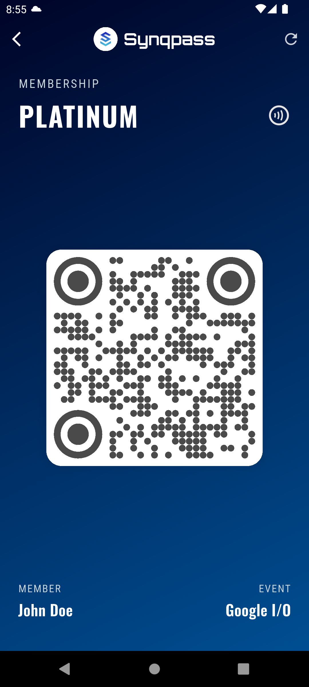

# Synqpass

Synqpass is a sleek, modern event pass management application built with Flutter. This app is currently under development and serves as a dummy application to showcase a potential user flow and design.

## ✨ Features

*   **Modern, Dark UI:** A beautiful, custom-designed dark theme with gradients and modern fonts from Google Fonts.
*   **Event Discovery:** Browse a list of available events.
*   **Tiered Pass System:** Select from different pass tiers (e.g., Silver, Gold, Platinum) for each event.
*   **Dynamic QR Code Generation:** A unique QR code is generated for your event pass.
*   **Sleek Pass Design:** A visually appealing pass card that displays your event details, tier, and QR code.

## 🚀 Getting Started

To get a local copy up and running, follow these simple steps.

### Prerequisites

*   Flutter SDK: [https://flutter.dev/docs/get-started/install](https://flutter.dev/docs/get-started/install)

### Installation

1.  Clone the repo
    ```sh
    git clone https://github.com/LemonDrop847/synqpass.git
    ```
2.  Install packages
    ```sh
    flutter pub get
    ```
3.  Run the app
    ```sh
    flutter run
    ```

## 📺 Demo
[demo.mp4](https://raw.githubusercontent.com/LemonDrop847/synqpass/main/demo.mp4)
<video src="demo.mp4" controls width="60%"></video>




## 🛣️ Roadmap

*   [ ] User authentication
*   [ ] Real-time event data from a backend
*   [ ] Payment integration
*   [ ] Pass sharing and validation

## 🤝 Contributing

Contributions, issues, and feature requests are welcome!

## 📄 License

Distributed under the MIT License. See `LICENSE` for more information.
